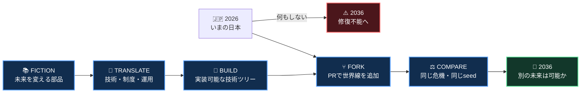
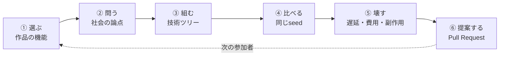
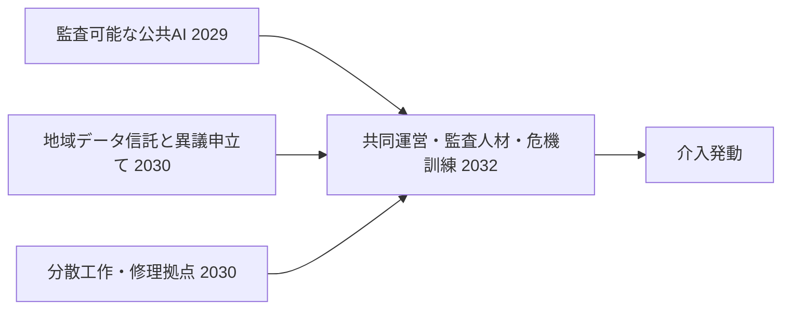

<div align="center">

# FICTION FORKS

### フィクションの部品で、日本の未来をforkする。

**アニメ・漫画・小説・ゲーム** × **技術ツリー** × **日本 2026→2036**

`決定的シミュレーション`　`Pull Request = 新しい世界線`　`オープン参加`

</div>



| 何もしない世界 | あなたが加える部品 | 比較できる未来 |
|:---:|:---:|:---:|
| **2036年に破滅** | 作品の機能を現実へ翻訳 | 発動・遅延・副作用を同条件で検証 |
| 修復能力を失う | 技術＋制度＋運用をつなぐ | PRごとに新しい世界線が増える |

> [!IMPORTANT]
> **一つのPull Requestが、一つの未来分岐になります。** 作品の強さを競うのではなく、その発想を現実に実装する条件と代償を競うゲームです。

**[▶ 3分で試す](#クイックスタート)**　·　**[⑂ 未来をforkする](#未来をforkする)**　·　**[◎ 現在の世界を見る](#現在遊べる世界)**　·　**[◇ 設計を読む](#設計を読む)**

アニメ、漫画、小説、ゲームは、未来技術のカタログであると同時に、専門や国籍が違う人どうしでも「この構造のこと」と短く指せる共通言語です。Fiction Forksでは、その共通言語を作品鑑賞で終わらせず、技術・制度・運用・完成証拠を持つ介入へ変換します。

## 目的

フィクションを、専門・国籍・世代の違う参加者が同じ未来問題を指せる共通言語にすることです。作品由来の機能を、実装年数、制度、費用、失敗条件を持つ反証可能な介入へ変換し、「面白いアイデア」で終わらない未来設計を作ります。

### 何が面白いのか

「ドラえもんの道具があれば解決」では終わりません。

- その機能を現実では何に翻訳するか
- 誰が作り、誰が所有し、誰が異議を申し立てられるか
- 技術だけでなく、法律、運用、人材、訓練が何年で揃うか
- 間に合わない、悪用される、維持費が重い世界では何が起きるか

を宣言し、無介入世界と同じショック・同じ乱数seedで比較します。人気投票ではなく、反証可能な未来実装ゲームです。

### ゲームループ



## できること

- 無介入の日本2036世界線を、同じseedで再現する
- 作品由来の介入を加え、破滅年と5つの状態値を比較する
- 技術・制度・運用ノードの依存関係から介入発動年を計算する
- 特定ノードを遅らせ、実装が間に合わない世界線を試す
- 介入JSONと比較結果をPull Requestにして、新しい未来分岐を追加する

## 現在遊べる世界

初期シナリオは、2026年から2036年までの日本です。島国であり、海上物流、海外資源、国際通信、海外AI基盤へ依存する一方、大国間対立、複合災害、情報操作へ同時に備える必要があります。

無介入世界では2036年に破滅します。ここでいう破滅は国の消滅ではなく、生活基盤・認知主権・修復能力のうち2項目が35未満となり、それが2年続く「自力で誤りを見つけ、代替し、直せない状態」です。

現在実行できる最初の介入は、『ドラえもん』を「未来の道具への公共アクセス」というレンズとして使います。これを、監査可能な公共AI、地域データ信託、分散工作・修理拠点、共同運営訓練へ翻訳します。作品の画像、台詞、キャラクター、公式設定は収録しません。

| 2036年の結果 | 無介入 | 『ドラえもん』レンズ介入 |
|---|---:|---:|
| 破滅判定 | 破滅（2036年） | 回避 |
| 生活基盤 | 43 | 38 |
| 戦略的自律性 | 17 | 40 |
| 認知主権 | 6 | 11 |
| 正統性 | 38 | 43 |
| 修復能力 | 33 | 63 |

介入は万能ではありません。平時の維持費として生活基盤を5点悪化させる一方、修復能力を30点、戦略的自律性を23点改善します。最後の共同運営・訓練が5年遅れると発動は2037年になり、2036年の破滅に間に合いません。

この数値は現実予測ではなく、因果仮説を追跡するMVP用のテスト値です。現実との接点と反証条件は [シナリオ根拠](docs/scenario-rationale.md) に分離しています。

## クイックスタート

Python 3.11〜3.13を使用します。外部Python依存はありません。

```powershell
$env:PYTHONPATH = "src"
python -m fiction_forks compare `
  --scenario scenarios/japan-2036/scenario.json `
  --intervention interventions/doraemon-public-tools.json `
  --seed 2036
```

共同運営と危機訓練を5年遅らせ、実装が間に合わない世界も比較できます。

```powershell
$env:PYTHONPATH = "src"
python -m fiction_forks compare `
  --scenario scenarios/japan-2036/scenario.json `
  --intervention interventions/doraemon-public-tools.json `
  --delay-node joint-governance-and-drills=5 `
  --seed 2036
```

基準世界だけを見る場合:

```powershell
$env:PYTHONPATH = "src"
python -m fiction_forks simulate `
  --scenario scenarios/japan-2036/scenario.json `
  --seed 2036
```

## 未来をforkする

参加者が行うことは6つです。

1. 作品から、未来を変えそうな機能を一つ選ぶ。
2. 作品を知らない人にも通じる社会の問いへ一文で翻訳する。
3. `technology`、`institution`、`operations` の依存ツリーを作る。
4. 各ノードへ観測可能な `completion_evidence` を書く。
5. 費用、副作用、失敗条件、意図的な遅延を含めて比較する。
6. 介入JSONと結果をPull Requestにする。

『呪術廻戦』なら「大多数には見えない危機を専門家だけが認識する社会」、『攻殻機動隊』なら「接続社会の本人性と公権力監査」、『日本沈没』なら「巨大リスクをいつ信じて公正な退避へ変えるか」という入口にできます。作品を知らない人向けの同義表現は [フィクション・レンズ](docs/fiction-lenses.md) にあります。

介入カードに必要な項目、技術ツリーの書き方、PRの検証方法は [コントリビューションガイド](CONTRIBUTING.md) を参照してください。

## 技術ツリー

介入は、最後の必須ノードが完成するまで効果を発生させません。



コードや装置だけでは未完成です。権限移譲、異議申立て、単一事業者停止を含む訓練まで観測できて初めて、社会の状態値へ効果を与えます。

## シミュレーション契約

毎年、次の順序で状態を更新します。

```text
前年の状態
  -> 基準世界の構造変化
  -> 共通の外部ショック
  -> 技術ツリーを満たした介入
  -> 状態値の更新
  -> 破滅条件の判定
```

5つの状態値を扱います。

| 状態値 | 表すもの |
|---|---|
| `living_systems` | 電力、食料、物流、通信、医療などの生活基盤 |
| `strategic_autonomy` | 海外技術・資源が止まっても動ける度合い |
| `cognitive_sovereignty` | 共通事実を保ち、情報操作を発見できる能力 |
| `legitimacy` | 政策決定を監査し、異議を申し立てられる度合い |
| `repair_capacity` | 失敗を観測し、代替し、制度を更新できる能力 |

同じscenario、intervention、seedは同じ結果を返します。数値更新と破滅判定は決定的ルールエンジンが所有し、将来LLMを追加しても状態値を創作させません。詳細は [シミュレーション契約](docs/simulation-contract.md) を参照してください。

## 設計を読む

| 文書 | 答える問い |
|---|---|
| [プロダクト設計](docs/product-design.md) | 誰が何をして、何を面白いと感じるのか |
| [UXフロー](docs/ux-flow.md) | Web版ではどの画面をどの順で使うのか |
| [アーキテクチャ](docs/architecture.md) | ルールエンジン、UI、AI、GitHubをどう分離するか |
| [ADR](docs/adr/README.md) | なぜ現在の設計判断を選んだのか |
| [セキュリティモデル](docs/security-model.md) | 公開参加型repoで何を守り、何を入力させないか |
| [PROJECT SSOT](PROJECT_SSOT.md) | どの情報の正本がどこにあるか |

プロダクトの実装順は、まずCLIとJSON契約を安定させ、次に同じ結果を読むWeb UIを追加し、その後に制約内の説明や行動候補だけを扱うAI層を検討します。

## 公式根拠

本プロジェクトがハッカソンと「メタ安全保障」の公式根拠として扱うのは、次の2点だけです。

- [AIエージェント社会シミュレーションハッカソン Vol.2 公式サイト](https://hackathon.automata-lab.jp/)
- [構想ペーパー「メタ安全保障 — 概念解説とハッカソン課題の発想集」](https://prtimes.jp/a/?f=d80352-184-caedebb354dd205d5811c599da74761b.pdf)（片山俊大氏 v1.0ペーパー）

この2点にない説明、数値、シナリオ、破滅条件、フィクション介入はFiction Forks独自の仮説です。政府統計などはシナリオの参照根拠であり、ハッカソンの公式見解ではありません。境界は [公式情報の正本](docs/official-sources.md) に固定しています。

## 権利・安全・限界

- 作品名と、Fiction Forksが独自に抽出した抽象的な機能を参照できます。
- 公式画像、漫画コマ、台詞、音声、映像、音楽、ロゴ、キャラクター表現、特徴的な口調は収録しません。
- 本プロジェクトは非公式であり、権利者、出版社、制作会社の公認・協力・推奨を示しません。
- 実在人物の個人情報、非公開会話、credential、実在システムの脆弱性・標的・攻撃手順を入力しません。
- 出力は政策助言、災害予測、軍事予測ではありません。

新規作成したコードと文書は [MIT License](LICENSE) で提供します。MIT Licenseは第三者IPへ適用されません。詳細は [THIRD_PARTY_NOTICES.md](THIRD_PARTY_NOTICES.md) と [SECURITY.md](SECURITY.md) を参照してください。

## バージョンと正本

現在の版は `0.1.0` です。通常はpatchを小刻みに上げ、互換性を保った大きな機能追加でminor、schemaを破壊する変更でmajorを上げます。自動version bumpは行いません。規律は [VERSIONING.md](VERSIONING.md)、利用者影響は [CHANGELOG.md](CHANGELOG.md) に記録します。

コード、scenario、介入、設計文書の正本はこのリポジトリです。非公開の着想元や参加者情報は複製しません。詳しくは [PROJECT_SSOT.md](PROJECT_SSOT.md) を参照してください。
