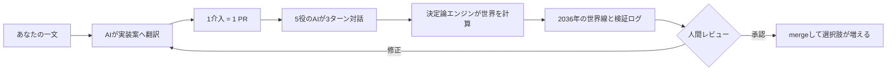
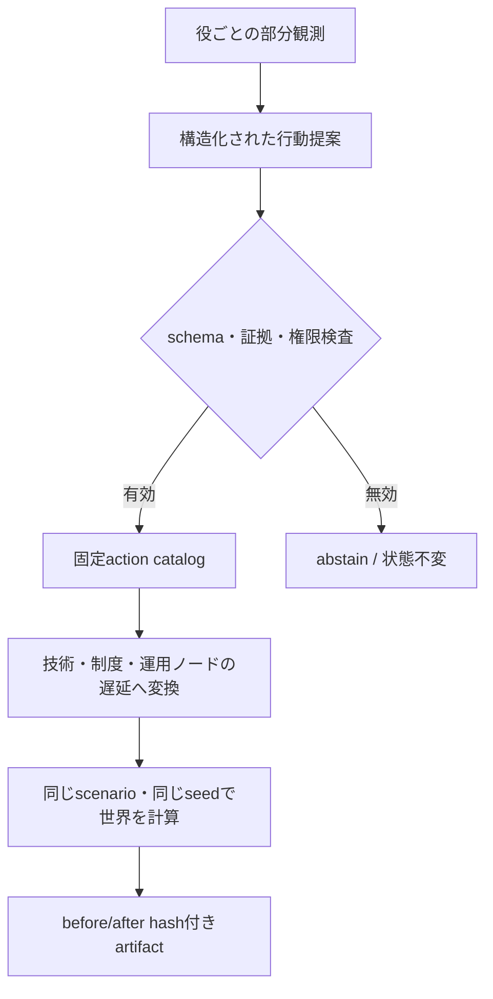

<div align="center">

# FICTION FORKS

### フィクションの部品で、日本の未来をforkする。

**アニメ・漫画・小説・ゲーム** × **5人のAIエージェント** × **日本 2026→2036**

[](https://github.com/nexus-ai-2045/fiction-forks/actions/workflows/ci.yml)　`コード不要で参加`　`Pull Request = 新しい世界線`

</div>

<p align="center">
  
</p>

> **作品から「未来を変える機能」を一つ借りたら、日本の2036年はどう変わるか。**
> アイデアをAIに伝えるだけで、技術・制度・運用の介入へ翻訳し、複数の社会役が議論する新しい世界線をPull Requestとして追加できます。

> [!NOTE]
> 現在公開しているrunはプロトコル検証用fixtureで、LLMの実測ではありません。live AI-agent runは未実行です。実装はlive providerに対応し、実行後はartifactとreplayを分けて記録します。

## コードを書かずに参加する

やることは一つです。好きな作品とアイデアを一文で書き、下をそのままAIへ渡してください。CLIやGitの知識は必要ありません。

```text
次のGitHubリポジトリで、私のアイデアを新しい世界線として実装してください。

リポジトリ:
https://github.com/nexus-ai-2045/fiction-forks

アイデア:
（作品名と、未来へ取り入れたい機能を一文で書く）

専用ブランチで、介入、技術・制度・運用ツリー、AIエージェント対話、
検証、必要なREADMEとADRを作り、結果と未確認事項を分けてPRにしてください。
必須成果物は interventions の介入JSON、social config、同一seedの放置／介入比較、
ノード遅延比較、全テスト結果です。CONTRIBUTING.mdの受入条件も満たしてください。
第三者の画像、ロゴ、音声、台詞、キャラクター再現は追加しないでください。
PR作成はmergeや公開完了ではないので、人間レビュー前で止めてください。
```



## 何をシミュレーションするのか

放置した日本は2036年に「自分たちで誤りを発見し、代替し、直せない状態」へ入ります。国の消滅を断言する予測ではなく、破滅条件を先に公開したテスト世界です。

フィクションの機能を持ち込むと、次の5役が異なる立場と部分観測から議論します。

| AIの役 | 守ろうとするもの |
|---|---|
| 市民監査役 | 説明可能性、停止条件、異論 |
| 基盤技術者 | 小さく試せて地域で直せる技術 |
| 物流運用者 | 代替経路、引継ぎ、共同訓練 |
| 地域翻訳者 | 理解できる同意、撤回、地域差 |
| 脅威分析役 | 悪用、依存、誤作動への防御境界 |

対話は「初期立場 → 複合障害 → 他役の懸念を翻訳して改訂」の3ターンです。各行動は `support`、`condition`、`oppose`、`abstain` の立場と、応答先の過去提案を持ちます。反対された提案は決定論的reducerで不採用になり、技術ツリーの遅延へ反映されます。AIは状態値や破滅判定を直接書き換えられません。不正な出力、未知field、失敗、timeoutは `abstain` になり、世界状態を変えません。



詳細は [AIエージェント社会シミュレーション](docs/social-simulation.md) と [ADR 0008](docs/adr/0008-ai-agents-choose-bounded-actions.md) にあります。

## 現在の世界線

### 未来技術への公共アクセス

『ドラえもん』を「未来の道具へ公共アクセスできる社会」というレンズで読み替えます。監査可能な公共AI、地域データ信託、分散工作・修理拠点、共同運営訓練へ翻訳しており、作品素材や公式設定は収録しません。

| 2036年 | 放置世界 | 介入が間に合う世界 |
|---|---:|---:|
| 破滅判定 | 破滅 | 回避 |
| 生活基盤 | 43 | 38 |
| 戦略的自律性 | 17 | 40 |
| 認知主権 | 6 | 11 |
| 正統性 | 38 | 43 |
| 修復能力 | 33 | 63 |

最後の共同運営・訓練が5年遅れると発動は2037年になり、2036年の破滅に間に合いません。介入には費用、副作用、失敗条件があり、都合のよい力だけを取り出すことはできません。数値は未来予測ではなく、因果仮説を追跡するMVP用テスト値です。

### 複数系統で世界の変化を観測する

『涼宮ハルヒの憂鬱』を「一つの権威では捉えきれない世界の変化を、複数の観測者が継続的に照合する」というレンズで読み替えます。公開仕様の分散観測網、証拠来歴と対立仮説の検証、訂正・撤回・異議申立て、地域横断の停止訓練へ翻訳します。万能な観測者、人物、物語、台詞は再現しません。

| 2036年（seed 2036） | 放置世界 | 観測介入が間に合う世界 |
|---|---:|---:|
| 破滅判定 | 破滅 | 回避 |
| 生活基盤 | 43 | 38 |
| 戦略的自律性 | 17 | 22 |
| 認知主権 | 6 | 35 |
| 正統性 | 38 | 45 |
| 修復能力 | 33 | 56 |

通常は2032年に発動しますが、証拠来歴と対立仮説の公開検証が5年遅れると発動は2037年となり、介入効果が一度も発生しないまま2036年に破滅します。維持費で生活基盤を5点悪化させるほか、監視社会化、誤警報、意思決定遅延を明示的な副作用として扱います。機械可読な通常比較、遅延比較、5役×3ターンのfixtureは [RESULTS](RESULTS.md) に記録しています。

## PRがどう反映されるか

| 状態 | 意味 |
|---|---|
| アイデア受付 | 要望を受け取っただけ |
| 実装中 | 専用branchで介入と対話条件を作成中 |
| PR作成済み | 差分、結果、未確認事項をレビューできる |
| 人間承認済み | 権利、安全、設計、検証を人が確認した |
| merge済み | repositoryへ新しい世界線が追加された |
| 反映確認済み | mainから再実行し、結果artifactを読み戻した |

PRを作っただけでは完成、merge、release、公式化にはなりません。merge後も既存世界を上書きせず、比較できる選択肢が一つ増えます。

## 権利・安全・限界

- 作品名と、独自に抽出した抽象的な機能を共通言語として参照できます。
- 公式画像、漫画コマ、台詞、音声、映像、音楽、ロゴ、キャラクター表現、特徴的な口調は収録しません。
- 本プロジェクトは非公式であり、権利者や制作会社の協力・公認を示しません。
- 実在人物の個人情報、非公開会話、credential、実在システムの脆弱性・標的・攻撃手順を入力しません。
- 出力は政策助言、災害予測、軍事予測ではありません。

## 設計と実測結果

| 文書 | 内容 |
|---|---|
| [RESULTS](RESULTS.md) | 実行済みrun、hash、未実測事項 |
| [社会シミュレーション](docs/social-simulation.md) | 5役、3ターン、provider、replay |
| [シミュレーション契約](docs/simulation-contract.md) | 年次状態更新と破滅条件 |
| [フィクション・レンズ](docs/fiction-lenses.md) | 作品を知らない人にも通じる同義表現 |
| [コントリビューションガイド](CONTRIBUTING.md) | PRに必要な介入カードと検証 |
| [ADR](docs/adr/README.md) | 設計判断と見直し条件 |
| [PROJECT SSOT](PROJECT_SSOT.md) | 正本と非公開情報の境界 |

<details>
<summary><strong>開発者向け：ローカルで実行する</strong></summary>

Python 3.11〜3.13を使います。決定論fixtureで5役×3ターンを再現する場合:

```powershell
$env:PYTHONPATH = "src"
python -m fiction_forks social `
  --scenario scenarios/japan-2036/scenario.json `
  --intervention interventions/doraemon-public-tools.json `
  --social-config scenarios/japan-2036/social.json `
  --provider fixture `
  --fixture fixtures/social/japan-2036-cooperation.jsonl `
  --output run.json
```

live providerの依存関係は、hash固定済みlockから導入します。

```powershell
python -m pip install --require-hashes -r requirements-agents.txt
python -m pip install -e . --no-deps
```

そのうえで、モデル、API key、費用発生への明示確認がある場合だけ `--provider openai --model gpt-5.4-mini --confirm-live` で実行します。CIは外部APIを呼びません。生成したartifactは `--provider replay --replay run.json` で再検証できます。

従来の年次比較だけを行う場合は `python -m fiction_forks compare --scenario scenarios/japan-2036/scenario.json --intervention interventions/doraemon-public-tools.json --seed 2036` です。

世界観測介入は、介入・social config・fixtureを差し替えて実行できます。

```powershell
$env:PYTHONPATH = "src"
python -m fiction_forks social `
  --scenario scenarios/japan-2036/scenario.json `
  --intervention interventions/haruhi-world-observation.json `
  --social-config scenarios/japan-2036/social-world-observation.json `
  --provider fixture `
  --fixture fixtures/social/japan-2036-world-observation.jsonl `
  --seed 2036 `
  --output run.json
```

</details>

## 公式根拠

- [AIエージェント社会シミュレーションハッカソン Vol.2 公式サイト](https://hackathon.automata-lab.jp/)
- [構想ペーパー「メタ安全保障 — 概念解説とハッカソン課題の発想集」](https://prtimes.jp/a/?f=d80352-184-caedebb354dd205d5811c599da74761b.pdf)（片山俊大氏 v1.0）

この2点にない数値、シナリオ、破滅条件、フィクション介入はFiction Forks独自の仮説です。現在の版は `0.2.0`。Git tagとGitHub Releaseは未作成です。
