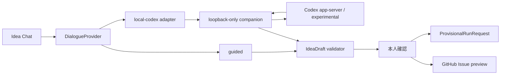

# アーキテクチャ

## 原則

シミュレーション状態は決定的ルールエンジンが所有する。CLI、Idea Builder、将来の比較Web UI、可視化、AIエージェントは、同じ入力と結果を読み書きする境界層であり、独自に状態値や破滅判定を変更しない。

```mermaid
flowchart LR
    participant["一般参加者"] --> web["React + TypeScript workbench"]
    web --> dialogue["DialogueProvider"]
    dialogue --> guided["guided / providerなし"]
    dialogue --> companion["optional local Codex companion"]
    guided --> draft["確認済みIdeaDraft"]
    companion --> draft
    draft --> previewGate{"既存templateで完全？"}
    previewGate -->|yes| preview["provisional run request"]
    previewGate -->|no| missing["not-simulatable / 不足条件"]
    preview --> engine
    draft --> issue["idea Issue"]
    missing --> issue
    issue --> contributor["外部: fork + branch / チーム: branch / AI / Colab"]
    contributor --> intervention["intervention JSON"]
    contributor --> socialInput["social config + fixture"]
    scenario["scenario JSON"] --> agents["5役のAIエージェント"]
    intervention --> agents
    socialInput --> agents
    agents --> catalog["制約付きaction catalog"]
    catalog --> engine["決定的ルールエンジン"]
    seed["seed・遅延条件"] --> engine
    engine --> result["result JSON"]
    result --> cli["CLI"]
    result --> checks["PR check summary"]
    result --> report["比較レポート"]
    result --> replay["artifact replay"]
    result --> browser["Result Browser"]
    result --> issueReturn["元Issueへ状態・結果を還流"]
    result --> doomCandidate["doom-candidate"]
    doomCandidate --> scenarioReview["scenario PR / 人間レビュー"]
    cli --> checks["test・CI・repo gates"]
    checks --> pullRequest["worldline Pull Request"]
```

## レイヤーと責務

| レイヤー | 現在の場所 | 所有するもの | 所有しないもの |
|---|---|---|---|
| 契約データ | `scenarios/`, `interventions/` | 仮説、効果、技術ツリー、完成証拠 | 実行ロジック |
| ルールエンジン | `src/fiction_forks/engine.py` | 検証、年次更新、遅延、破滅判定 | UI、自由記述の意味解釈 |
| 社会エージェント | `agent_protocol.py`, `social.py` | 部分観測、行動検証、actionから遅延への変換、hash chain | 状態値、効果量、破滅判定 |
| Provider | `providers.py` | fixture、replay、live LLMの入出力境界 | 世界状態、credential保存 |
| CLI | `src/fiction_forks/cli.py` | 引数、JSON入出力、exit code | 状態遷移規則 |
| Web workbench | `web/` | Doom Map、参加入口、chat/UI状態、typed result projection、Issue Markdown | metric、破滅判定、GitHubへの自動投稿 |
| 対話provider | `DialogueProvider`（0.4で追加） | 理解確認、質問、`IdeaDraft`候補 | metric delta、破滅レベル、公式結果 |
| Local companion | loopback process（spike） | Codex protocolの縮小adapter、短命session | public listen、raw tool委譲、secret保存 |
| 暫定run adapter | 0.4で追加 | 確認済みdraftを既存templateへ写像しengineへ渡す | 未知の効果量生成、official判定 |
| PR契約 | `pr_contract.py`, `.github/` templates | idea/worldline/maintenance分離、投稿者とfixture結果のsummary | merge判断、live LLM実測 |
| 共同編集 | GitHub | diff、review、CI、履歴 | シミュレーションの暗黙変更 |

## 実行フロー

1. scenarioとinterventionをschema契約で検証する。
2. 技術ツリーの重複、未知依存、循環、完成証拠を検査する。
3. seedから共通ショックを決定する。
4. 基準効果、ショック、発動済み介入の順で状態を更新する。
5. 0〜100へ丸め、破滅条件を判定する。
6. timeline、発動年、技術スケジュール、最終状態をJSONで返す。
7. compareは同一年の基準世界と介入世界を比較する。

## Web実装境界

0.3で公開準備したWeb面は、`web/`のdependency-freeな静的Idea Builderである。入力をIssue Markdownへ変換する投影層に限定し、GitHub token、独自backend、database、telemetryを持たない。

0.4 milestoneでは、simulation画面、chat状態、結果browserが必要になったため、`web/`をVite + React + TypeScriptへ移行する。Python engineを唯一の状態遷移実装とし、TypeScriptはversion付きrequest/result schema、表示、入力途中の状態だけを所有する。Python fixtureとTypeScript validatorのcross-language contract testを必須にする。

暫定previewは確認済み`IdeaDraft`が既存介入templateへ完全に写像できる場合だけPython engineへ渡す。効果量や技術ノードが未確定なら`not-simulatable`を返す。engineをTypeScriptへ複製しない。

ブラウザの表示状態とsimulation stateを分ける。フィルタ、選択中ノード、drawerの開閉はUI状態だが、指標、発動年、破滅判定はresult JSONから取得する。テキスト量の多いHUD、設定、アクセシビリティ操作はDOMで実装する。

## チャットとlocal Codex境界

Webは`DialogueProvider`だけを知り、Codex固有protocolをcomponentへ埋め込まない。

公開Pagesからraw app-serverへ直接WebSocket接続しない。companionはCodexのversion差、認証、origin、schemaを吸収し、Webへ返すmessageを`IdeaDraft`に限定する。Codexへ渡すworkspaceは対象repoのread-only contextを既定とし、shell、write、GitHub操作は公開Web由来のchat sessionでは許可しない。app-serverが未導入、未対応version、認証失敗の場合は`guided`へfail closedする。

Codex CLI 0.130.0-alpha.5で、`app-server`、WebSocket listen、TypeScript binding生成が手元に存在することはspikeの開始根拠になるが、experimental機能の継続提供を製品契約にしない。実装時にversionと生成schemaを再実測する。

## 結果還流とadaptive doom

Ideaの状態は`listed / assigned / implemented / simulated / reported-back`を別fieldで持つ。Issueのopen/closedだけからsimulation完了を推定しない。公式runはworldline ID、元Issue、scenario、seed、engine version、artifact digestを結び、WebとIssueへ同じstatus projectionを返す。

既存破滅を回避したworldlineは履歴として固定する。次の危機は`DoomCandidate`として、原因となった介入、現実リスクとの接続、発生条件、観測指標、連鎖、可逆性を持つ。scenario PRと人間レビューを通るまでactive doomへ昇格せず、AIがゲーム継続のためだけに破滅判定を変更しない。

## AI実装境界

現在のAIエージェントへ許可するのは次に限定する。

- 固定catalogからのaction選択
- 観測済みevidence ID、対象役、確信度、採用条件
- 280文字以内の説明

AI出力は未信頼入力としてstrict schema検証を通す。AIは効果量、外部ショック、破滅条件、根拠の公式性を自動確定しない。不正出力は`abstain`として状態不変にする。live providerは明示確認がある場合だけ起動し、API keyやprivate observationをartifactへ保存しない。

## GitHub境界

未実装の着想は`idea` Issue、一つの世界分岐は`worldline` Pull Request、保守は`maintenance` Pull Requestとする。CIは少なくとも次を検査する。

- Python 3.11と3.13でunit test
- 基準世界と初期介入の比較smoke
- scenario/interventionの契約違反
- version SSOTの同期
- trackedかつignoredの新規増加を `ai-ratchet-gate` で拒否
- PR本文markerと変更pathによる種別分離
- worldline PRの同一slug intervention、social config、fixture
- 投稿者名、5役×3ターンfixture、2036年比較のstep summary

`repo-preflight` はPR、push、公開、releaseの各境界でローカルとremoteのbindingを再確認する。gateのpassはmerge、release、visibility変更の承認を意味しない。

## 派生物

CLI出力、Web可視化、比較レポート、FigJam/Figma図、AI要約は派生物である。研究記録として残す場合は、scenario、intervention、seed、遅延条件、engine versionを併記する。

## 変更時の判断

- 状態遷移や結果schemaの変更: ADRと互換性判定が必要
- 表示だけの変更: engineのgolden resultが不変であることを確認
- AI層の追加: threat modelと明示的なtool/input/output schemaが必要
- local companionの追加: origin、token、sandbox、tool allowlist、version gate、保持境界の実機証拠が必要
- 暫定previewの追加: `not-simulatable`経路とPython/TypeScript contract一致が必要
- adaptive doomの追加: DoomCandidateからscenario PRへの人間レビュー経路が必要
- remote write、公開、release: repo-preflightと人間の境界確認が必要

設計判断の理由は [ADR index](adr/README.md) を参照する。
