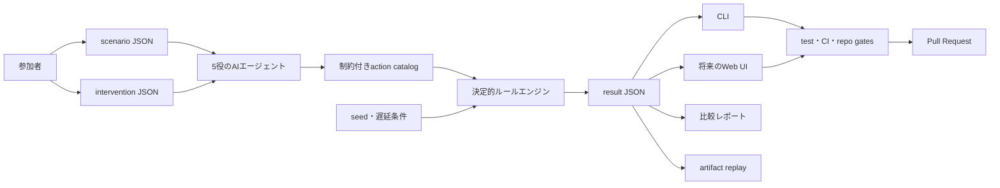

# アーキテクチャ

## 原則

シミュレーション状態は決定的ルールエンジンが所有する。CLI、将来のWeb UI、可視化、AIエージェントは、同じ入力と結果を読み書きする境界層であり、独自に状態値や破滅判定を変更しない。

## レイヤーと責務

| レイヤー | 現在の場所 | 所有するもの | 所有しないもの |
|---|---|---|---|
| 契約データ | `scenarios/`, `interventions/` | 仮説、効果、技術ツリー、完成証拠 | 実行ロジック |
| ルールエンジン | `src/fiction_forks/engine.py` | 検証、年次更新、遅延、破滅判定 | UI、自由記述の意味解釈 |
| 社会エージェント | `agent_protocol.py`, `social.py` | 部分観測、行動検証、actionから遅延への変換、hash chain | 状態値、効果量、破滅判定 |
| Provider | `providers.py` | fixture、replay、live LLMの入出力境界 | 世界状態、credential保存 |
| CLI | `src/fiction_forks/cli.py` | 引数、JSON入出力、exit code | 状態遷移規則 |
| 表示層 | 将来の `web/` | 比較、timeline、tree、入力支援 | 正本の数値更新 |
| 共同編集 | GitHub | diff、review、CI、履歴 | シミュレーションの暗黙変更 |

## 実行フロー

1. scenarioとinterventionをschema契約で検証する。
2. 技術ツリーの重複、未知依存、循環、完成証拠を検査する。
3. seedから共通ショックを決定する。
4. 基準効果、ショック、発動済み介入の順で状態を更新する。
5. 0〜100へ丸め、破滅条件を判定する。
6. timeline、発動年、技術スケジュール、最終状態をJSONで返す。
7. compareは同一年の基準世界と介入世界を比較する。

## Web実装境界

最初のWeb版はReact + Viteを候補とし、Pythonエンジンと一致する読み取り専用の比較画面から始める。採用前に、次のどちらで決定性を保つかを別ADRで確定する。

- Python APIを唯一の実行器としてWebから呼ぶ
- 契約テストを共有し、TypeScriptへ同一ルールを移植する

ブラウザの表示状態とsimulation stateを分ける。フィルタ、選択中ノード、drawerの開閉はUI状態だが、指標、発動年、破滅判定はresult JSONから取得する。テキスト量の多いHUD、設定、アクセシビリティ操作はDOMで実装する。

## AI実装境界

現在のAIエージェントへ許可するのは次に限定する。

- 固定catalogからのaction選択
- 観測済みevidence ID、対象役、確信度、採用条件
- 280文字以内の説明

AI出力は未信頼入力としてstrict schema検証を通す。AIは効果量、外部ショック、破滅条件、根拠の公式性を自動確定しない。不正出力は`abstain`として状態不変にする。live providerは明示確認がある場合だけ起動し、API keyやprivate observationをartifactへ保存しない。

## GitHub境界

Pull Requestは一つの世界分岐のレビュー単位である。CIは少なくとも次を検査する。

- Python 3.11と3.13でunit test
- 基準世界と初期介入の比較smoke
- scenario/interventionの契約違反
- version SSOTの同期
- trackedかつignoredの新規増加を `ai-ratchet-gate` で拒否

`repo-preflight` はPR、push、公開、releaseの各境界でローカルとremoteのbindingを再確認する。gateのpassはmerge、release、visibility変更の承認を意味しない。

## 派生物

CLI出力、Web可視化、比較レポート、FigJam/Figma図、AI要約は派生物である。研究記録として残す場合は、scenario、intervention、seed、遅延条件、engine versionを併記する。

## 変更時の判断

- 状態遷移や結果schemaの変更: ADRと互換性判定が必要
- 表示だけの変更: engineのgolden resultが不変であることを確認
- AI層の追加: threat modelと明示的なtool/input/output schemaが必要
- remote write、公開、release: repo-preflightと人間の境界確認が必要

設計判断の理由は [ADR index](adr/README.md) を参照する。
