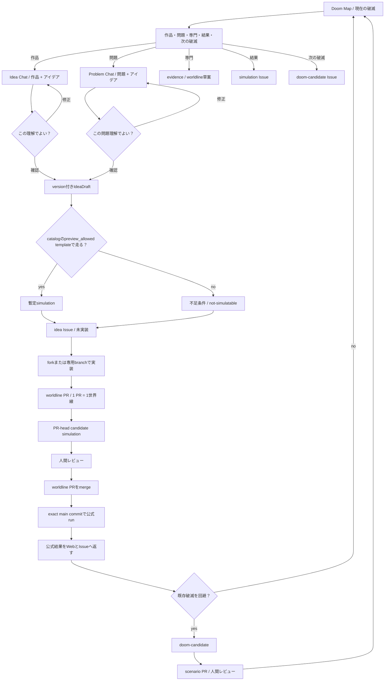

# UXフロー

## 体験目標

初めて訪れた人が、作品のファン向け企画ではなく「フィクションを使って実装可能な未来介入を比較する道具」だと理解し、現在の破滅状況、参加入口、過去結果を見たうえで、チャットから自分の世界線を作り始められること。

## 情報設計



現在のIdea BuilderはIssue文を作るだけで、engineまたはLLMを実行しない。0.4 milestoneでは、作品入口はIdea Chat、問題入口はProblem Chatへ進め、本人が確認した`IdeaDraft`だけを暫定previewまたはIssueへ渡す。専門・過去結果・次の破滅は、それぞれevidence/worldline草案、simulation Issue、doom-candidate Issueへ分岐させ、作品fieldを強制しない。暫定previewはversion付きcatalogで許可された固定templateだけを使い、公式結果とは別表示にする。publicではtriage済みsimulation-requestを`main`固定workflowで非同期実行し、localではloopback adapterから同じPython CLIを実行する。worldline PRのchecksはcandidate runであり、merge後のexact `main` commitで再実行したrunだけを公式結果として元Issueへ返す。

Webは「作品」と「アイデア」だけを一ページで受け付け、open/closedを含む公開Idea IssueをGitHubからread-only取得する。取得不能時はHTMLに保存した直近一覧を表示する。repoへmergeされた介入は、公式repo内の実装JSONまたはPRへリンクする。Ideaカードの「AIにworldline PR化を頼む」はIssue URL入りの依頼文をコピーするだけで、branch作成、push、PR作成、simulationは自動実行しない。

## 主要画面

| 画面 | 最初に答える問い | 主操作 | 出力 |
|---|---|---|---|
| Doom Map | どの破滅が、どのレベルで、いつ迫っているか | active doomを選ぶ | レベル、因果鎖、到達年、確からしさ |
| 参加入口 | 自分は何を持ち込めるか | 作品・問題・専門・結果・次の破滅を選ぶ | 入口別workflow |
| Idea Chat | この作品とアイデアを、どう理解したか | 対話し「この理解でよい」を確認 | `IdeaDraft` |
| Provisional Preview | 今あるmodelで何が試せ、何が未確定か | 暫定比較を実行 | 暫定結果または`not-simulatable` |
| 世界比較 | 介入で何が良くなり、何が悪くなるか | 「この介入を試す」 | 同一年の差分 |
| 技術ツリー | 何が完成すれば効果が出るか | ノードを選ぶ | 完成年、依存、完成証拠 |
| 遅延実験 | どこが遅れると間に合わないか | 遅延年を変える | 発動年、破滅年 |
| Result Browser | 今まで何を試し、何が問題になったか | worldline、run、争点を絞る | 公式結果、artifact、元Issue |
| Fork Builder | IdeaDraftの何を現実へ翻訳するか | 段階入力 | 介入JSON草案 |
| PR Preview | 提案は比較・反証・レビューできるか | 「PR用差分を確認」 | 検証結果とチェック項目 |
| Next Doom | 回避した世界が次に何を壊し得るか | candidateを比較する | doom-candidate Issue / scenario PR草案 |

## 第一画面のワイヤー

```text
Fiction Forks                         [過去の結果] [GitHub]

JAPAN 2036 / DOOM LEVEL — CONTRACT PENDING

放置した日本は2036年に修復不能へ入る。
いま最も近い破滅: 修復能力の喪失 / 推定11年

[現在の破滅を見る]  [アイデアを話す]

どこから参加する？
[作品] [問題] [専門] [過去結果] [次の破滅]
```

このワイヤーの破滅レベル表示は情報階層の例であり、現在値ではない。version付き`DoomLevelContract`とPython実装がscenarioから再計算できるまで、UIは数値を表示せず、既存engineの`collapsed`、`collapse_year`、breached metricsをそのまま示す。

常時表示する要素は、現在年、破滅判定、選択中の世界線、主操作に絞る。根拠、長い説明、設定はdrawerまたは別画面へ置き、比較対象を隠さない。

## Idea Chat

作品入口の最初の入力は「作品」と「アイデア」だけでよい。問題入口では「active doom」と「アイデア」を使い、作品は任意にする。専門・結果・次の破滅の入口はこのchatを強制せず、情報設計で定めた成果物へ進む。対話providerは一度に質問を増やさず、次の順で壁打ちする。

1. 理解した内容を一文で返す。
2. 作品を知らない人向けの抽象機能へ言い換える。
3. 作用しそうなactive doomと、そう考えた理由を示す。
4. 実現条件、副作用、失敗条件のうち、結果を大きく変える未確定点だけを最大3件聞く。
5. 「このアイデアでよいですか」と確認する。
6. 本人が確認した後だけ`IdeaDraft`を作る。

対話providerが使えない場合も、同じ順序を固定質問で進める`guided` modeを残す。local Codex modeはloopback companionを利用者が明示起動した場合だけ表示し、未接続、version不一致、認証失敗では`guided`へ戻す。

`IdeaDraft`の最小表示:

```text
理解: どこでもドア型の移動を、災害医療の公共インフラへ翻訳する
対象: 物流・医療アクセスの破滅連鎖
未確定: エネルギー、本人確認、国境・悪用対策
副作用候補: 地方空洞化、単一技術依存、軍事転用

この理解でよいですか？ [修正する] [この案で試す]
```

## 暫定結果と公式結果

| 区分 | 許される入力 | 表示 | 保存・共有 |
|---|---|---|---|
| 壁打ち | 自由記述 | 理解、質問、候補 | 自動保存しない |
| 暫定preview | 既存scenario、catalogの`preview_allowed` template、確認済みIdeaDraft | 暫定、未確定field、input digest | publicはtriage済みrequestを非同期実行、localはloopback実行 |
| fixture | repo内fixture | protocol検証 | PR artifact |
| live run | 明示model、費用確認、投影済み入力 | live、model、保持境界 | curated artifactだけ |
| 公式結果 | merge済みworldline、exact main commitのrun、artifact digest | 公式worldline結果 | Web、RESULTS、元Issueへ還流 |

暫定previewが作れないことは失敗ではない。必要なmetric効果、技術ノード、完成証拠、scenario対応が足りない場合、数値を埋めず「この3点を決めれば走る」と返す。

## Fork Builder

一度にJSON全体を見せず、次の順で一概念ずつ開示する。

1. レンズ: 作品名と抽出する機能
2. 同義表現: 作品を知らない人向けの一文
3. 実現方式: `literal` / `functional_equivalent` / `institutional_equivalent`
4. 技術ツリー: ノード種別、依存、年数、完成証拠
5. 効果と代償: 改善、費用、副作用、失敗条件
6. ストレステスト: 遅延させるノードと年数
7. 提出確認: schema、再現性、権利、安全、公式根拠の境界

`literal` は現実にその機能を直接実現できる場合だけ選べる。作品設定をそのまま実在すると扱う選択肢ではない。

## 状態と文言

| 状態 | 推奨文言 | 避ける文言 |
|---|---|---|
| 実行前 | 「同じ条件で2つの世界を比較します」 | 「未来を予測します」 |
| 理解確認 | 「このアイデアとして理解しました。合っていますか？」 | 「最適な政策はこれです」 |
| 暫定preview | 「既存templateによる暫定比較です」 | 「シミュレーションで証明されました」 |
| 未実行 | 「この条件が未確定のため、まだ走らせられません」 | 数値を推測して表示する |
| 破滅 | 「修復不能条件に入りました」 | 「日本は必ず崩壊します」 |
| 回避 | 「このモデルでは破滅条件を回避しました」 | 「問題を解決しました」 |
| 遅延 | 「発動が2037年となり、2036年に間に合いません」 | 「失敗です」だけ |
| 入力不足 | 「完成証拠を観測可能な文にしてください」 | 「無効です」だけ |
| PR準備完了 | 「ローカル検証が通りました。人間レビューは未完了です」 | 「公開準備完了」 |
| 次の破滅 | 「回避済み世界から生じる次シーズン候補です」 | 「勝利は無効になりました」 |

## 視覚言語

Web実装時はSaaSダッシュボードではなく「分岐する時間軸を読む作戦卓」とする。ただし軍事司令画面を模倣せず、市民参加と監査可能性を中心に置く。

共通token、図形、ラベル、READMEヒーローとの整合は [ビジュアルシステム](visual-system.md) を正本とする。

- 基底色: 高コントラストの明色または暗色を一方に固定する
- 基準世界: 無彩色
- 介入世界: 青緑系
- 破滅条件: 赤だけに依存せず、形・文言・アイコンを併用する
- 技術ノード: `technology`、`institution`、`operations` を色とラベルで二重符号化する
- 数値: 大きな総合スコアを作らず、5指標を同じ尺度で表示する
- 動き: 世界線の分岐、介入発動、破滅条件だけに使う

## レスポンシブとアクセシビリティ

- キーボードだけで世界線選択、ノード選択、遅延変更を行える
- Mermaidを含む図には同じ情報の表または本文を併記する
- 色だけで状態を伝えない
- motion reductionを尊重する
- モバイルでは比較表を横スクロールさせず、年ごとの縦並びへ変換する
- 長い根拠とcompletion evidenceは省略せず、開閉可能な本文として提供する
- 作品を知らない人向けの同義表現を作品名の直後に表示する

## Figma引継ぎ仕様

外部Figmaファイルを作成する前に、次のframeを同じ情報設計で作る。

- Desktop: 1440 × 1024 — 世界比較、技術ツリー、Fork Builder
- Mobile: 390 × 844 — 世界比較、ノード詳細、提出確認
- Component states: default、hover、focus、selected、loading、error、collapsed、breach

Figmaは画面構成の検討先であり、シミュレーション規則や数値の正本にはしない。正本は [PROJECT_SSOT.md](../PROJECT_SSOT.md) に従う。
