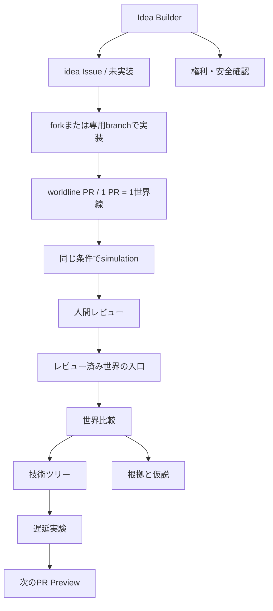

# UXフロー

## 体験目標

初めて訪れた人が、作品のファン向け企画ではなく「フィクションを使って実装可能な未来介入を比較する道具」だと理解し、既存世界を実行してから自分の世界線を作り始められること。

## 情報設計



Idea BuilderはIssue文を作るだけで、engineまたはLLMを実行しない。simulationは、contributorが介入・social config・fixtureをworldline PRへ揃え、PR checksが同じseedで実行した時に初めて発生する。結果はPRへ戻り、人間レビュー後にだけ共有世界へ入る。

## 主要画面

| 画面 | 最初に答える問い | 主操作 | 出力 |
|---|---|---|---|
| 世界の入口 | 放置すると、いつ、なぜ破滅するのか | 「基準世界を見る」 | 破滅条件と因果鎖 |
| 世界比較 | 介入で何が良くなり、何が悪くなるか | 「この介入を試す」 | 同一年の差分 |
| 技術ツリー | 何が完成すれば効果が出るか | ノードを選ぶ | 完成年、依存、完成証拠 |
| 遅延実験 | どこが遅れると間に合わないか | 遅延年を変える | 発動年、破滅年 |
| Fork Builder | 作品の何を現実へ翻訳するか | 段階入力 | 介入JSON草案 |
| PR Preview | 提案は比較・反証・レビューできるか | 「PR用差分を確認」 | 検証結果とチェック項目 |

## 第一画面のワイヤー

```text
Fiction Forks                         [GitHub] [設計を読む]

フィクションの部品で、
日本の未来をforkする。

放置した日本は2036年に修復不能へ入る。
作品から一つの機能を選び、技術・制度・運用へ翻訳して、
間に合う世界と間に合わない世界を同じ条件で比べる。

[基準世界を見る]  [3分でCLIを試す]

2036  無介入: 破滅  |  ドラえもん・レンズ: 回避
```

常時表示する要素は、現在年、破滅判定、選択中の世界線、主操作に絞る。根拠、長い説明、設定はdrawerまたは別画面へ置き、比較対象を隠さない。

## Fork Builder

一度にJSON全体を見せず、次の順で一概念ずつ開示する。

1. レンズ: 作品名と抽出する機能
2. 同義表現: 作品を知らない人向けの一文
3. 実現方式: `literal` / `functional_equivalent` / `institutional_equivalent`
4. 技術ツリー: ノード種別、依存、年数、完成証拠
5. 効果と代償: 改善、費用、副作用、失敗条件
6. ストレステスト: 遅延させるノードと年数
7. 提出確認: schema、再現性、権利、安全、公式根拠の境界

`literal` は現実にその機能を直接実現できる場合だけ選べる。作品設定をそのまま実在すると扱う選択肢ではない。

## 状態と文言

| 状態 | 推奨文言 | 避ける文言 |
|---|---|---|
| 実行前 | 「同じ条件で2つの世界を比較します」 | 「未来を予測します」 |
| 破滅 | 「修復不能条件に入りました」 | 「日本は必ず崩壊します」 |
| 回避 | 「このモデルでは破滅条件を回避しました」 | 「問題を解決しました」 |
| 遅延 | 「発動が2037年となり、2036年に間に合いません」 | 「失敗です」だけ |
| 入力不足 | 「完成証拠を観測可能な文にしてください」 | 「無効です」だけ |
| PR準備完了 | 「ローカル検証が通りました。人間レビューは未完了です」 | 「公開準備完了」 |

## 視覚言語

Web実装時はSaaSダッシュボードではなく「分岐する時間軸を読む作戦卓」とする。ただし軍事司令画面を模倣せず、市民参加と監査可能性を中心に置く。

共通token、図形、ラベル、READMEヒーローとの整合は [ビジュアルシステム](visual-system.md) を正本とする。

- 基底色: 高コントラストの明色または暗色を一方に固定する
- 基準世界: 無彩色
- 介入世界: 青緑系
- 破滅条件: 赤だけに依存せず、形・文言・アイコンを併用する
- 技術ノード: `technology`、`institution`、`operations` を色とラベルで二重符号化する
- 数値: 大きな総合スコアを作らず、5指標を同じ尺度で表示する
- 動き: 世界線の分岐、介入発動、破滅条件だけに使う

## レスポンシブとアクセシビリティ

- キーボードだけで世界線選択、ノード選択、遅延変更を行える
- Mermaidを含む図には同じ情報の表または本文を併記する
- 色だけで状態を伝えない
- motion reductionを尊重する
- モバイルでは比較表を横スクロールさせず、年ごとの縦並びへ変換する
- 長い根拠とcompletion evidenceは省略せず、開閉可能な本文として提供する
- 作品を知らない人向けの同義表現を作品名の直後に表示する

## Figma引継ぎ仕様

外部Figmaファイルを作成する前に、次のframeを同じ情報設計で作る。

- Desktop: 1440 × 1024 — 世界比較、技術ツリー、Fork Builder
- Mobile: 390 × 844 — 世界比較、ノード詳細、提出確認
- Component states: default、hover、focus、selected、loading、error、collapsed、breach

Figmaは画面構成の検討先であり、シミュレーション規則や数値の正本にはしない。正本は [PROJECT_SSOT.md](../PROJECT_SSOT.md) に従う。
